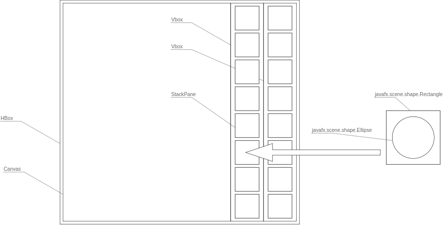

# Week 03-04 : Calendar Week 37/38 (09/11 - 09/23)

## Reading

GR : Section 1.1, Chapter 2 through 2.2
J9N : Chapter 5 : through 5.7
J9N : Chapter 6 : 6.4, 6.5, 6.6
J9N : Chapter 10 : 10.1.3 - 10.1.5, 10.2.1

## Assignments

- Homework 2
  - Sep 26
  - 140 pts

- Video :: Simple Object Paint Demo (10m)

### 2 Application Structure

In this assignment we will use a `scene graph` and build up the top layer of the
application using JavaFX

#### 2.1 Layout Panes and the Scene Graph

1. The root node of the application should be an `Hbox`
   1. HBox layout pane places elements side by side in order of insertion
      1. First insert the `canvas` object
      2. Then two `VBox panes` to hold each of the columns of `tools` and `colors`
   2. `VBox pane` orders elements vertically in the order that they are placed within the pane
2. To create each tool you will start with a `StacPane` that stacks objects on top of each other in the order that they are placed in the pane
   1. First object that you place in the pane is a `javafx.scene.shape.Rectangle` object
      1. Represents the background square of the tool
   2. Set the color and shape of this object to reflect whether or not the tool is either a shape or color tool
   3. Finally, for the tool objects, you will place another `javafx.scene.shape` object over the top of the rectangle
      1. E.g., for the Ellipse/or Oval tool, you will use a `javafx.scene.shape.Ellipse` object

#### 2.2 Graphics Objects and the Canvas

Structure of the graphic shapes and how we will draw, store, and manage these shapes
constantly redraw the shape that we are currently exploring without committing it to the canvas

##### 2.2.1 Layers

1. Overlay a transparent canvas on top of the canvas where the drawing is located

##### 2.2.2 Object Lists

